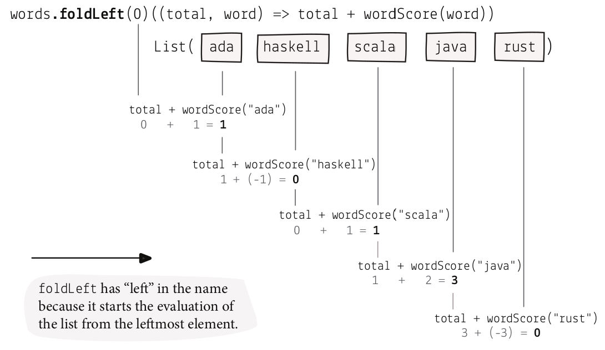

# Functions as values

## Coffee break: Functions as parameters

```java
Function<String, Integer> penalty = w -> w.contains("c") ? 7 : 0;
Function<String, Integer> bonusScoreWithPenalty = w -> scoreWithBonus(w) - penalty(w);
rankedWords(w -> scoreWithPenalty(w), words);
```


## Practicing function passing

```scala
def sortByLen(l: List[String]): List[String] = l.sortBy(_.length)
def sortByS(l: List[String]): List[String] = l.sortBy(_.filter(c => c == 's').length)
def sortByIntDesc(l: List[Int]): List[Int] = l.sortBy(i => -i)
def sortBySDesc(l: List[String]): List[String] = l.sortBy(-_.filter(c => c == 's').length)
```

## Embracing declarative programming

### Ranking the words in a hacky way

```scala
def rankedWords(wordScore: String => Int,
                words: List[String]): List[String] = {
  def negativeScore(word: String): Int = -wordScore(word)
  words.sortBy(negativeScore)
}
```

### Ranking the words declaratively

```scala
def rankedWords(wordScore: String => Int,
                words: List[String]): List[String] =
  words.sortBy(wordScore).reverse
```

## Coffee break: Passing functions in Scala


```scala
def rankedWords(wordScore: String => Int,
                words: List[String]): List[String] =
  words.sortBy(wordScore).reverse

def score(word: String): Int = word.replaceAll("a", "").length
def bonus(word: String): Int = if (word.contains("c")) 5 else 0
def penalty(word: String): Int = if (word.contains("s")) 7 else 0

rankedWords(score, words)
rankedWords(s => score(s) + bonus(s), words)
rankedWords(s => score(s) + bonus(s) - penalty(s), words)
```

## Practicing `map`

```scala
List("scala", "rust", "ada").map(_.length)
List("rust", "ada").map(_.filter(c => c == 's').length)
List(5, 1, 2, 4, 0).map(-_)
List(5, 1, 2, 4, 0).map(_ *)
```

## Practicing `filter`

```scala
List("scala", "rust", "ada").filter(_.length < 5)
List("rust", "ada").filter(_.filter(c => c == 's').length > 2)
List(5, 1, 2, 4, 0).filter(_ % 2 == 1)
List(5, 1, 2, 4, 0).filter(_ > 4)
```

## Our journey so far ...

1. Passing functions as arguments. Functions are values that can be passed as arguments into other
functions.
2. Returning functions from functions. Functions are values that can be returned from other functions.
3. Functions as values. Functions are values that can be passed

## Don’t repeat yourself?

- A high-scoring word is a word with a score higher than 1 (current implementation).
- A high-scoring word is a word with a score higher than 0.
- A high-scoring word is a word with a score higher than 5.

We need to repeat a lot of code.

## Is my API easy to use?

We return a function which takes an int as a parameter so that the code doesn't have to be repeated.

## Adding a new parameter is not enough

We can add a parameter but the scoring function has to be repeated:

```scala
def highScoringWords(wordScore: String => Int,
                     words: List[String],
                     higherThan: Int): List[String] =
  words.filter(word => wordScore(word) > higherThan)

highScoringWords(w => score(w) + bonus(w) - penalty(w), words, 1)
highScoringWords(w => score(w) + bonus(w) - penalty(w), words, 0)
highScoringWords(w => score(w) + bonus(w) - penalty(w), words, 5)
```

## Using functions that can return functions

```scala
def highScoringWords(wordScore: String => Int,
                     words: List[String]): Int => List[String] =
  higherThan => words.filter(word => wordScore(word) > higherThan)

val wordsWithScoreHigherThan: Int => List[String] =
  highScoringWords(w => score(w) + bonus(w) - penalty(w), words)

wordsWithScoreHigherThan(1)
→ List("java")
wordsWithScoreHigherThan(0)
→ List("ada", "scala", "java")
wordsWithScoreHigherThan(5)
→ List()
```

## Coffee break: Returning functions

```scala

def greaterThan(gt: Int): Int => Boolean = (i: Int) => i > gt
List(5, 1, 2, 4, 0).filter(greaterThan(4))
List(5, 1, 2, 4, 0).filter(greaterThan(1))

def divisibleBy(db: Int): Int => Boolean = (i: Int) => i % db == 0
List(5, 1, 2, 4, 15).filter(divisibleBy(5))
List(5, 1, 2, 4, 15).filter(divisibleBy(2))

def shorterThan(st: Int): String => Boolean = (s: String) => s.length < st
List("scala", "ada").filter(shorterThan(4))
List("scala", "ada").filter(shorterThan(7))

def sCountGreater(sc: Int): String => Boolean = s => s.filter(c => c == 's').length > sc
List("rust", "ada").filter(sCountGreater(2))
List("rust", "ada").filter(sCountGreater(0))
```

## Using multiple parameter lists in functions

```scala
def highScoringWords(wordScore: String => Int)(higherThan: Int)(words: List[String]): List[String] =
  words.filter(word => wordScore(word) > higherThan)
```

## We have been currying!

Transforming multiple-parameter functions into a series of one-parameter functions returned from each other is called *currying*

`def f(a: A, b: B, c: C): D` -> **Uncurried** multiple-parameter function that takes three parameters and returns a value of type D

`def f(a: A): B => C => D` -> **Curried** one-parameter function that takes one parameter and returns another one-parameter function which in turn returns a one-parameter function that returns a value of type D

`def f(a: A)(b: B)(c: C): D` -> **Curried** one-parameter function that takes one parameter and returns another one-parameter function which in turn returns a one-parameter function that returns a value of type D

## Practicing currying

```scala
def greaterThan(gt: Int)(i: Int): Boolean = i > gt
List(5, 1, 2, 4, 0).filter(greaterThan(4))
List(5, 1, 2, 4, 0).filter(greaterThan(1))

def divisibleBy(db: Int)(i: Int):Boolean = i % db == 0
List(5, 1, 2, 4, 15).filter(divisibleBy(5))
List(5, 1, 2, 4, 15).filter(divisibleBy(2))

def shorterThan(st: Int)(s: String): Boolean = s.length < st
List("scala", "ada").filter(shorterThan(4))
List("scala", "ada").filter(shorterThan(7))

def sCountGreater(sc: Int)(s: String): Boolean = s.filter(c => c == 's').length > sc
List("rust", "ada").filter(sCountGreater(2))
List("rust", "ada").filter(sCountGreater(0))
```

## Programming by passing function values

A function that takes or returns another function is called a **higher-order function**. `sortBy`, `map`, and `filter` are just examples from the standard library,

## Reducing many values into a single one using foldLeft

We need to return a cumulative score of words provided as an input list.

`foldLeft` takes each element of the list, applies the provided function to it and an ongoing total, then passes it to the next element

```scala
def cumulativeScore(wordScore: String => Int,
                    words: List[String]): Int =
  words.foldLeft(0)((total, word) => total + wordScore(word))
```

## `foldLeft` must-knows

`foldLeft` has “left” in the name because it starts the evaluation of the list from the leftmost element.




## Practicing `foldLeft`

```scala
List(5, 1, 2, 4, 100).foldLeft(0)((acc, i) => acc + i)
List("scala", "rust", "ada").foldLeft(0)((acc, w) => acc + w.length)
List("scala", "haskell", "rust", "ada").foldLeft(0)((acc, w) => acc + w.filter(c => c == 's').length)
List(5, 1, 2, 4, 15).foldLeft(Int.MinValue)((max, i) => if (i > max) i else max)
```

## Modeling immutable data

Functional languages provide a special language construct to define nonprimitive immutable values that can hold multiple values of different types. In FP, it’s called a product type, and we encode it as a `case class` in Scala.

```scala
case class ProgrammingLanguage(name: String, year: Int)
```

```typescript
type ProgrammingLanguage = {
  readonly name: string;
  readonly year: number;
}
```

## More concise syntax for inline functions

```scala
val javalang = ProgrammingLanguage("Java", 1995)
val scalalang = ProgrammingLanguage("Scala", 2004)
val languages = List(javalang, scalalang)

languages.map(_.name)
languages.filter(_.year > 2000)
```

## Summary

### Passing functions as parameters

### The `sortBy` function

Then, we sorted a given List in Scala by calling the `sortBy` higher-order function and providing a function as an argument. Nothing was mutated.

### `map` and `filter` functions

We used exactly the same technique to transform the Lists using the map and filter functions

### Returning functions from functions

We returned functions from functions to configure a function based on incoming parameters. It's called *currying*

### `foldLeft` function

`foldLeft` is able to reduce a list of values to a single value

### Modeling immutable data using product type

`case class` is a Scala implementation of immutable product types which is a convenient way to couple pieces of data together.
