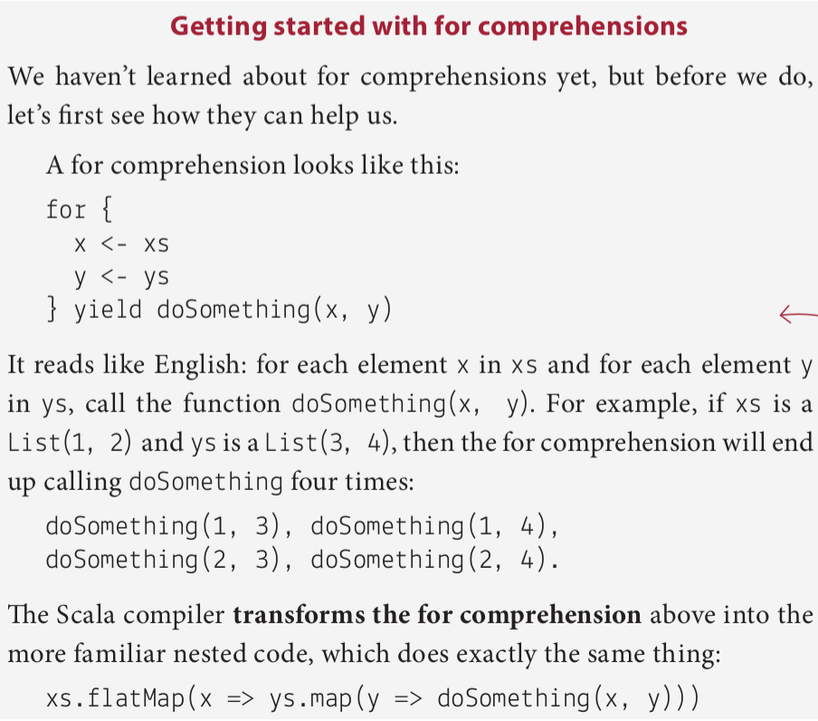
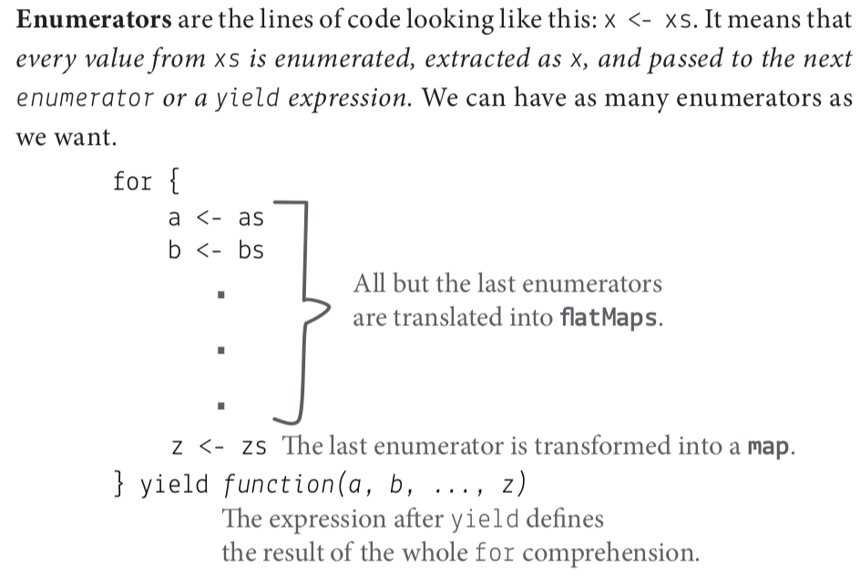

# Sequential programs

## Coffee break: Dealing with lists of lists

```scala
case class Book(title: String, authors: List[String])
def recommendedBooks(friend: String): List[Book] = {
  val scala = List(
    Book("FP in Scala", List("Chiusano", "Bjarnason")),
    Book("Get Programming with Scala", List("Sfregola")))
  val fiction = List(
    Book("Harry Potter", List("Rowling")),
    Book("The Lord of the Rings", List("Tolkien")))
  if(friend == "Alice") scala
  else if(friend == "Bob") fiction
  else List.empty
}

val friends = List("Alice", "Bob", "Charlie")
val recommendations = friends.flatMap(recommendedBooks)
val authors = recommendations.flatMap(_.authors)
```

## Values that depend on other values

```scala
def recommendationFeed(books: List[Book]) = {
  books.flatMap(book =>
    book.authors.flatMap(author =>
      bookAdaptations(author).map(movie =>
        s"You may like ${movie.title}, " +
        s"because you liked $author's ${book.title}"
      )
    )
  )
}
```

## Practicing nested `flatMaps`

```scala
case class Point(x: Int, y: Int)

List(1).flatMap(x => List(-2, 7).map(y => Point(x, y)))
```

How many points would be generated by the code above if we
- Changed `List(-2, 7)` to `List(-2, 7, 10)`? -> 3
- Changed `List(1)` to `List(1, 2)`? -> 4
- Changed both of the above at once? -> 6
- Changed `List(1)` to `List.empty[Int]`? -> 0
- Changed `List(-2, 7)` to `List.empty[Int]`? -> 0

## A better syntax for nested `flatMaps`

Nesting makes code less readable, especially when we add more levels of indentation.



## For comprehensions to the rescue!

```scala
for {
  book <- books
  author <- book.authors
  movie <- bookAdaptations(author)
} yield s"You may like ${movie.title}, " + s"because you liked $author's ${book.title}"

→ List(
  "You may like An Unexpected Journey, because you liked Tolkien's The Hobbit",
  "You may like The Desolation of Smaug, because you liked Tolkien's The Hobbit"
)
```

## Coffee break: `flatMaps` vs. for comprehensions

``` scala
case class Point(x: Int, y: Int)

val xs = List(1)
val ys = List(-2, 7)

for {
  x <- xs
  y <- ys
} yield Point(x, y)
```

Now, imagine that we added a list of z coordinates and the 3D point:

```scala
case class Point3d(x: Int, y: Int, z: Int)
val xs = List(1)
val ys = List(-2, 7)
val zs = List(3, 4)

for {
  x <- xs
  y <- ys
  z <- zs
} yield Point(x, y, z)

xs.flatMap(x => ys.flatMap(y => zs.map(Point(x, y, _))))
```

## It’s not the for you are looking for!

### Statements vs. expressions

A **statement** is a language construct that needs to change the state of
a program to be useful.

An **expression**, on the other hand, doesn’t operate on the global state,
always returns something, and, when executed many times, it always
returns the same result.

Functional programming is programming expressions. Functional programmers don’t use statements.

## Inside a for comprehension

It’s time to finally define the generic shape of a for comprehension and
how it translates into flatMap and map calls.

```
for {
  <enumerators>
} yield <output-expression>
```



## Filtering techniques

- Using `filter`
- Using a guard expression (`if` in a cor comprehension)
- Using a function passed to the `flatMap` function. e.g. returning an empty list if a predicate isn't true

## Coffee break: Filtering techniques

```scala
val points = List(Point(5, 2), Point(1, 1))
val riskyRadiuses = List(-10, 0, 2)

def isInside(point: Point, radius: Int): Boolean = {
  radius * radius >= point.x * point.x + point.y * point.y
}

// using filter
for {
  r <- riskyRadiuses.filter(_ > 0)
  point <- points.filter(isInside(_, r))
} yield s"$point is within a radius of $r"

// using guard
for {
  r <- riskyRadiuses if r > 0
  point <- points.filter(isInside(_, r))
} yield s"$point is within a radius of $r"


// using function
def validRadius(r: Int): List[Int] =
  if (r > 0) List(r) else List.empty

def insideFilter(p: Point, r: Int): List[Point] =
  if (isInside(p, r)) List(p) else List.empty

for {
  r <- riskyRadiuses
  validRadius <- validRadius(r)
  point <- points
  inPoint <- insideFilter(point, validRadius)
} yield s"$point is within a radius of $r"
```

## Using for comprehensions with many types

Can we use more than one type inside a for comprehension? More concretely, can we use `List`s and `Set`s in a single for comprehension?

### The first enumerator defines the return type

### We can mix enumerator types

## Practicing for comprehensions

```scala
for {
  x <- List(1, 2, 3)
  y <- Set(1)
} yield x * y
-> List(1, 2, 3)

for {
  x <- Set(1, 2, 3)
  y <- List(1)
} yield x * y
-> Set(1, 2, 3)

for {
  x <- List(1, 2, 3)
  y <- Set(1)
  z <- Set(0)
} yield x * y * z
> List(0, 0, 0)
```

## Defining for comprehensions ... again

The first enumerator defines the return type.

All but the last enumerators are translated into `flatMaps`

Guard expressions are translated into `filters`

The last enumerator is transformed into a `map`

The expression after `yield` defines the result of the whole `for` comprehension.

An **enumerator** can be one of two things: a generator or a guard expression (`filter`). We can have as many enumerators as we want.

A generator is the line of code looking like this: `x <- xs`

A **guard expression** is the line of code that looks like this: if expression(x)

A **first enumerator** is a generator that defines the collection return type of the whole for comprehension.

A **yield expression** defines the type of the objects inside the collection.

## Avoiding `null`s: `Option` type

`null`s make our signatures lie

`def parse(name: String, start: Int, end: Int): Event`

The signature says that the function returns an `Event` ... But it may, and does, also return a `null`!

```scala
def parse(name: String, start: Int, end: Int): Option[Event] = {
  if (name.size > 0 && end < 3000 & start <= end)
    Some(Event(name, start, end))
  else
    None
}
```

## Parsing as a pipeline

```scala
def validateName(name: String): Option[String] =
  if (name.size > 0) Some(name) else None
def validateEnd(end: Int): Option[Int] =
  if (end < 3000) Some(end) else None
def validateStart(start: Int, end: Int): Option[Int] =
  if (start <= end) Some(start) else None

def parse(name: String, start: Int, end: Int): Option[Event] =
  for {
    validName <- validateName(name)
    validEnd <- validateEnd(end)
    validStart <- validateStart(start, end)
  } yield Event(validName, validStart, validEnd)

parse("Apollo Program", 1961, 1972)
→ Some(Event("Apollo Program", 1961, 1972)))
parse("", 1939, 1945)
-> None
```

## Coffee break: Parsing with `Option`

```scala
def validateLength(start: Int, end: Int, minLength: Int): Option[Int] =
  if (end - start >= minLength) Some(end - start) else None

def parseLongEvent(name: String, start: Int, end: Int, minLength: Int): Option[Event] =
  for {
    validName <- validateName(name)
    validEnd <- validateEnd(end)
    validStart <- validateStart(start, end)
    _ <- validateLength(start, end, minLength)
  } yield Event(validName, validStart, validEnd)
```

## Summary

### Deal with lists of lists using `flatten`

### Write sequential programs using `flatMap` instead of `for` loops

### Write sequential programs in a readable way using for comprehensions

### Use conditions inside for comprehensions

### Get to know more types that have `flatMap`


